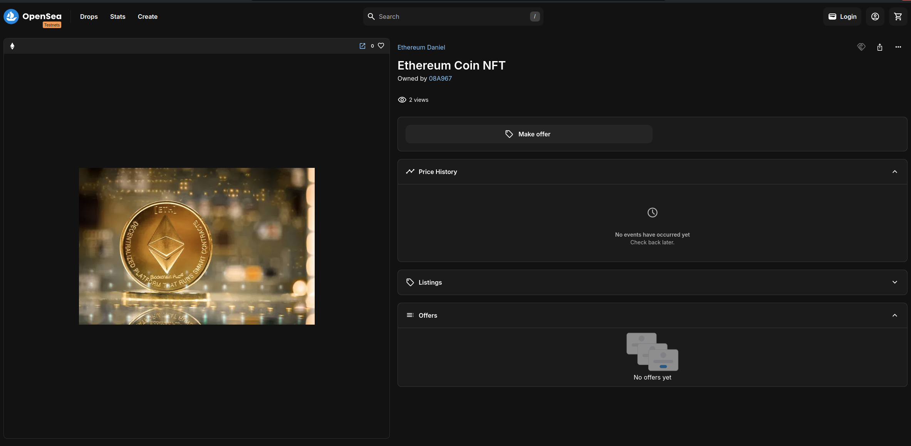

# Deployed NFT

<figure><figcaption></figcaption></figure>

#### Technologies

`Solidity` `Hardhat` `Ethereum` `Sepolia Testnet` `OpenZeppelin` `ERC-721` `NFT`

#### Description

NFT or ERC-721 Token deployed on Sepolia ETH Testnet using Hardhat. It uses OpenZeppelin ERC-721 Standard

#### &#x20;Deployment

<figure><figcaption>
NFT Contract info on Etherscan Sepolia Testnet
</figcaption></figure>

<figure><figcaption>
NFT Info on OpenSea
</figcaption></figure>

**NFT contract:** [0xfbE902aa67fa0d80445D15797cB69FB7Cf8c649a](https://sepolia.etherscan.io/address/0xfbe902aa67fa0d80445d15797cb69fb7cf8c649a)

**NFT Name:** Ethereum Daniel

**NFT Symbol:** ETHD

Check the NFT info on [OpeanSea](https://testnets.opensea.io/assets/sepolia/0xfbe902aa67fa0d80445d15797cb69fb7cf8c649a/0)

Check the source code on github

